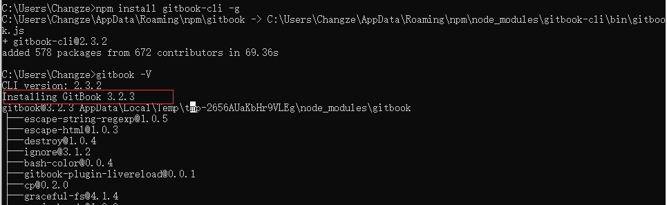
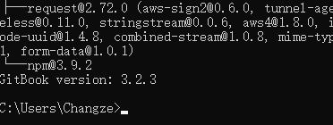
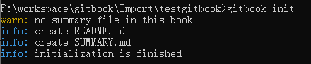
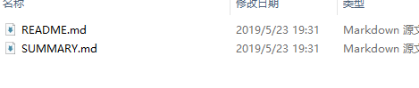
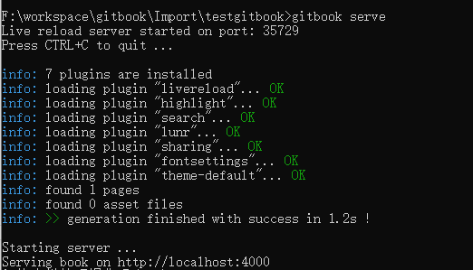
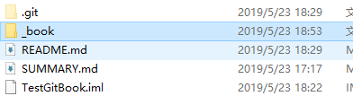
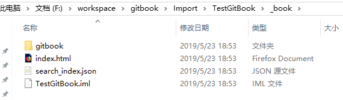

# 安装GitBook:

需要事先安装好node.js，然后在terminal下：

```
npm install gitbook-cli -g
```

查看版本：

```
gitbook -V
```




创建一本书：
```
gitbook init
```


生成两个文件：



启动服务：
```
gitbook serve  //该命令包含gitbook build
或者指定端口
gitbook serve --port xxxx
```


通过 http://localhost:4000/ 可以预览书籍
GitBook 写完编译后可以生成静态页面发布到博客上
编译gitbook :
```
gitbook build
或者指定路径
gitbook build [书籍路径] [输出路径]
```

编译后会在根目录下生成_book文件夹：



包含网页版静态文件:



除了生成web版的电子书，还可以：
```
生成 PDF 格式的电子书：
gitbook pdf ./ ./mybook.pdf

生成 epub 格式的电子书：
gitbook epub ./ ./mybook.epub

生成 mobi 格式的电子书：
gitbook mobi ./ ./mybook.mobi
```
